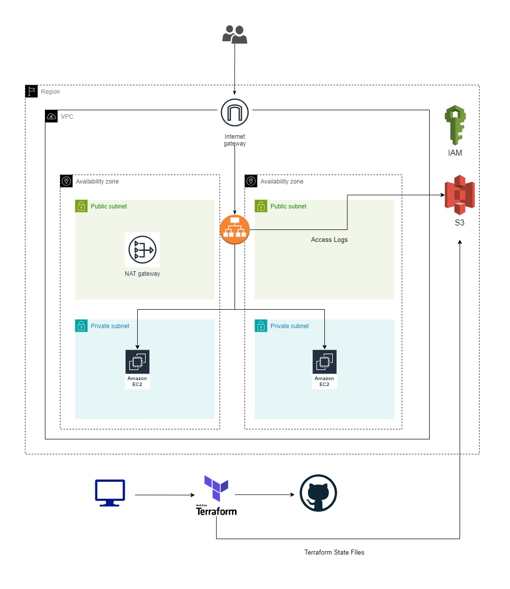

# Building AWS Architecture Ec2 with Load Balancer using Terraform

<h3>Project Overview</h3>

<div>The project involved the creation of a robust and scalable architecture on AWS using Terraform to provision resources efficiently. This architecture comprised two EC2 instances hosting NGINX servers, orchestrated by an Application Load Balancer (ALB) to distribute incoming traffic. The infrastructure was deployed within a Virtual Private Cloud (VPC) consisting of two public subnets for NAT gateway and ALB, and two private subnets spanning different availability zones to ensure high availability and fault tolerance.</div>



<h3>Description</h3>
The project aimed to deploy a resilient AWS architecture using infrastructure as code (IaC) principles to streamline resource provisioning and management. Leveraging Terraform, the infrastructure was divided into three modular components: Network, Server, and Load Balancer.


<h3>Root Module</h3>

<h4>Root Module inclues 3 main modules to build this approach architecture</h4>

```terraform
module "network" {
  source = "./NetwrokInfra"
  vpc_cidr_block   = var.vpc_cidr_block
  vpcname = "wlo-terraform-vpc"
  subnet-name = "terraform-subnet"
  wlo-terraform-igw-name = "wlo-terraform-igw"
  natgw-name = "terraform-nat-gw"
  publicrtname = "public-subnet-routetable"
  privatertname = "private-subnet-routetable"
}
module "server" {
  source = "./EC2"
  vpcid = module.network.vpcid
  subnetid = module.network.subnetid
  ami = "ami-09eb2ed0e9c2f6126"
  instance-type = "t2.micro"
  keypair = "wlo-keypair"
  instance-name = "ec2-terraform"
  ingress-port = [22,80,443]
}
module "loadbalancer" {
  source = "./LoadBalancer"
  vpcid = module.network.vpcid
  alb-ingress-port = [80,443]
  public-subnetid = module.network.public-subnetid
  instance-id = module.server.instance-id
  certificate = "your certificate arn"
}
```

<h3>Terraform Command:</h3>

```terraform
For terraform root module:

terraform init
terraform validate
terraform plan
terraform apply --auto-approve
```

<h3>Network Module</h3>
The Network module was responsible for creating the foundational components of the architecture within the VPC. This included defining the VPC itself, along with the associated subnets, route tables, and Internet Gateway. Two public subnets were designated for the ALB and NAT Gateway, while two private subnets were established across different availability zones to host the EC2 instances.

```terraform
module "network" {
  source = "./NetwrokInfra"
  vpc_cidr_block   = var.vpc_cidr_block
  vpcname = "wlo-terraform-vpc"
  subnet-name = "terraform-subnet"
  wlo-terraform-igw-name = "wlo-terraform-igw"
  natgw-name = "terraform-nat-gw"
  publicrtname = "public-subnet-routetable"
  privatertname = "private-subnet-routetable"
}
```

<h3>Server Module</h3>
The Server module focused on provisioning the EC2 instances running NGINX servers. These instances were deployed within the private subnets to ensure security and isolation from the internet while being accessible through the ALB. Configuration parameters such as instance type, AMI, security groups, and user data scripts were specified within this module.

```terraform
module "server" {
  source = "./EC2"
  vpcid = module.network.vpcid
  subnetid = module.network.subnetid
  ami = "ami-09eb2ed0e9c2f6126"
  instance-type = "t2.micro"
  keypair = "wlo-keypair"
  instance-name = "ec2-terraform"
  ingress-port = [22,80,443]
}
```

<h3>Load Balancer Module</h3>
The Load Balancer module was responsible for setting up the Application Load Balancer (ALB) to evenly distribute incoming traffic across the EC2 instances. This component defined the ALB listeners, target groups, and health checks to ensure efficient routing of requests to healthy instances.

```terraform
module "loadbalancer" {
  source = "./LoadBalancer"
  vpcid = module.network.vpcid
  alb-ingress-port = [80,443]
  public-subnetid = module.network.public-subnetid
  instance-id = module.server.instance-id
  certificate = "your certificate arn"
}
```
<h3>If you don't now how to get your certificate arn from AWS ACM , below link will be a good fit to research</h3>
<h4>https://medium.com/@wailinoo.2012/requesting-certificate-using-aws-certificate-manager-119f6ad8d2ab</h4>

<h3>Terraform Stage Management</h3>

We are using S3 Bucket to store Terraform state files for the purpose of collaboration, version control, and consistency across teams by providing a centralized location for storing and sharing infrastructure state. This prevents conflicts and enables concurrent modifications to infrastructure as code while maintaining integrity and facilitating rollbacks when necessary.

```terraform
terraform {
  backend "s3" {
    bucket         = "your S3 Bucket name to store state file"
    key            = "terraform.tfstate"  # Replace with a unique key for each configuration
    region         = "ap-southeast-1"
    encrypt        = true
    acl            = "private"
    #dynamodb_table = "terraform-lock"  # Optional: Use DynamoDB for state locking
  }
}
```

<h3>Conclusion</h3>
By structuring the architecture into modular components, the project aimed to achieve scalability, maintainability, and repeatability in infrastructure deployment and management. This approach facilitated easy scalability and future modifications to accommodate evolving business requirements and traffic demands. Additionally, using Terraform allowed for version-controlled infrastructure changes and simplified infrastructure provisioning across multiple environments.
